                    **Welcome to Parker Schimpff's Map portfolio!**

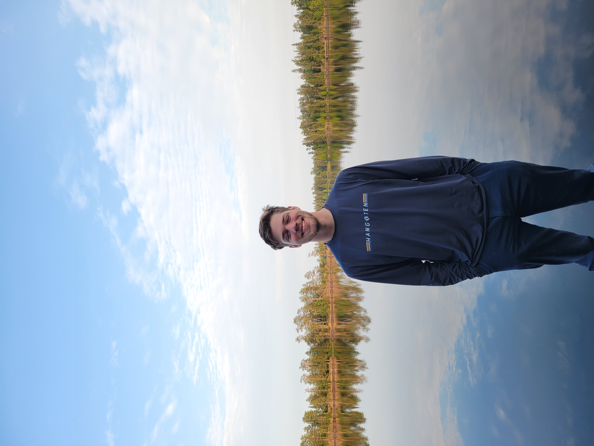
Fig. 1: Picture of me in front of Lake One in the Boundary Waters Wilderness Area

I am...

- A Sophomore at the University of Kentucky
- Majoring in Natural Resources and Environmental Science
- Minoring in GIS/Mapping and Jazz Piano Performance
- An intermediate Spanish speaker (may be an overestimation)
- A member of the Men's Acapella group on campus, acoUstiKats
- The pianist for Williamstown Christian Church
- An Eagle Scout
- A bookworm
- And, among many other things, an amatuer map maker

The goal of this webpage is simple: to present my work in ArcGIS Pro. From here down will be a display of many maps I have created for research, recreation, and coursework. There will be descriptions of why the map was created, what was found through the map, methodology of creating the map, data sources, and python code used (if any).

## Kentucky Landcover Map - February 2024

Fig. 2: [Kentucky Landcover PDF](./maps/kyLandcover2.pdf)

This map was created for my Advanced GIS class (GEO 409) in the Spring of 2024. It was created to be put in this [website](https://schimpffafa.github.io/geo409-field-trip/) which was my first assignment in website creation through Github and Visual Studio Code (the same program being used to create this portfolio!). This map was created completely through python code.

The 2016 National Landcover Dataset and the Shaded Relief dataset were acquired from MRLC and The National Map Download Service respectively.

### General python code flow used

1. Set input database, output database, environment workspace (same as input), spatial reference 3089 (KY FIPS).
2. Set area of interest variable to be the Kentucky State Polygon
3. Inside a *for* loop, use the *arcpy.analysis.Clip* command to clip all feature classes in input database by the area of interest.  The same command is used for all the raster layers. The clipped layers were outputted into the output database.
4. Set the environment workspace to the output database.
5. Use the *arcpy.da.SearchCursor* command on the clipped land cover raster in order to determine counts of cells for different land cover uses. Using this, along with math in a for loop, do calculations and print percentage of sq. miles of land use for each type of land use.

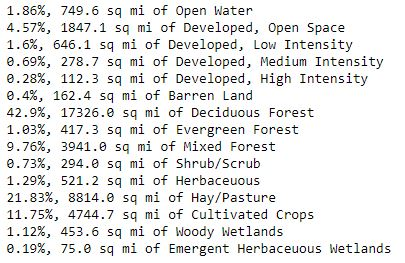  
Fig. 3: Results from the search cursor tool

This is the [IPYNB Script used](./scripts/landcoverClipping.ipynb).

## UK Campus Canopy Tree Height Map - Spring 2024

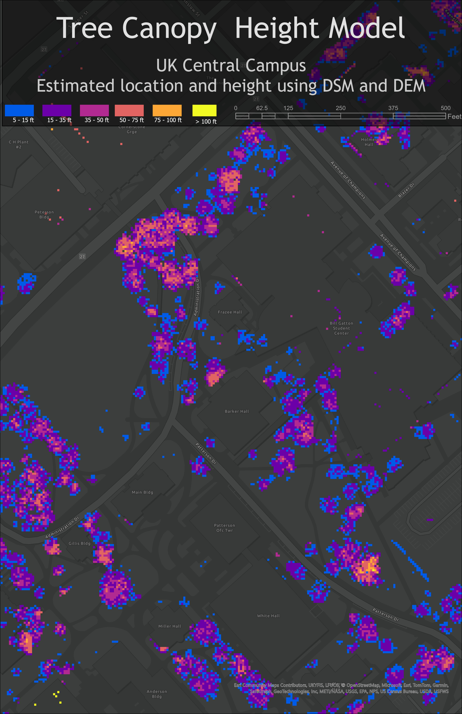
Fig. 4: [Campus Canopy PDF](./maps/CanopyHeightModel.pdf)

This map was created for my Advanced GIS class (GEO 409) in the Spring of 2024. It was created to be put in this [website](https://schimpffafa.github.io/geo409-field-trip/) which was my first assignment in website creation through Github and Visual Studio Code (the same program being used to create this portfolio!). This map was the second map included in that assignment, in conjunction with the Landcover map shown directly above this section. This map was created completely through python code.

The data for this map came from a variety of places. The DEM and DSM files are from the Kentucky from Above database. The NAIP is a national project from the US Geological Survey (USGS). The basemap is a standard basemap given by ESRI.

### Python code used

1. Set workspace as geodatabase containing DEM, DSM, and NAIP rasters clipped for the UK Campus.
2. Create a height raster (DSM-DEM)
3. Create a NDVI (Normalized Difference Vegetation Index) of campus using the command *arcpy.ia.NDVI()* with the NAIP raster as the target variable. This creates a raster layer for NDVI of the campus
4. Using those two variables, height and NVDI, we can use variable geometry to create a new raster of trees on campus. This was the code used:

        trees = arcpy.sa.Con(((ndvi > 0.1) & (height > 5)), height)
        trees.save('campus_trees_ndvi_01')

5. Once the trees layer is completed, use the *arcpy.sa.RemapRange* tool to re-class the raster layer into height groups. For this map, I chose 6 height groups that are visible in the legend.

This is the [IPYNB Script used](./scripts/model-tree-height.ipynb).

## Schimpff Farm 5040 OH State Route 222 - Fall 2023

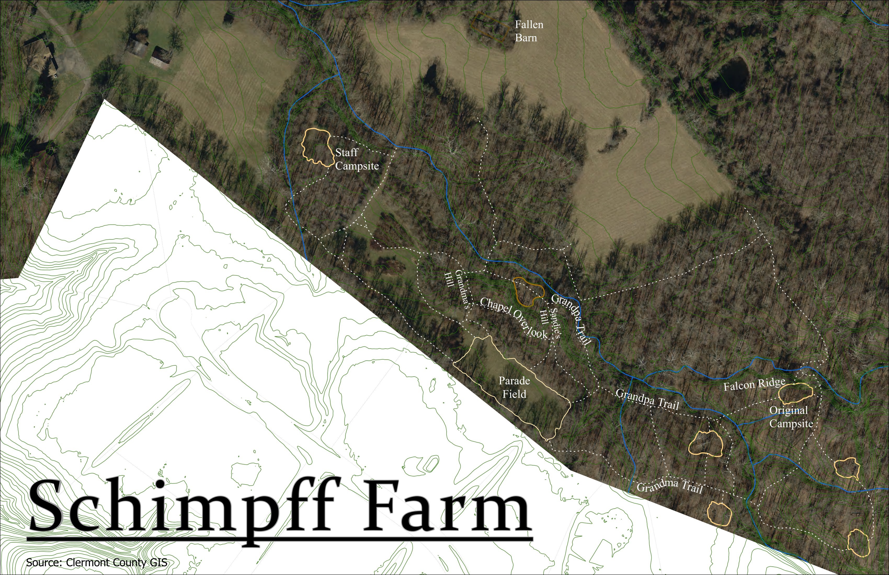
Fig. 5: [Schimpff Farm PDF](./maps/farmPrint.pdf)

### Reasons for creating this map

This map was a pet project. Truly, it was inspired by this map:

Fig. 6: [Camp Achewon Drawn Map](./maps/achewon.pdf)

My grandfather, for more than 50 years, lived on a piece of property, nicknamed "The Farm" by the family. A few years back, they sold the property. For many years, the farm was used by a local Boy Scout Troop, Troop 281 out of Anderson, Ohio, who worked with my grandfather in order to make trails, bridges, fields, and campsites. In the late 90s/early 2000s, the scouts at the time drew this map, with proposed additions to the land and a proposition to appeal to the Dan Beard Council to make Camp Achewon a recognized scout camp, available to be used by the whole council, not just Troop 281. Although these aspirations (specifically the treehouse and the lake) never materialized, the map they created was quite realistic and spatially accurate, and provided a good baseline to create drawn layers showing trails and campsites on top of ariel photography.

### Methodology

The farm is in Clermont County, OH, which has a GIS department. Using ariel photography from the summer of 2017 from Clermont Co. GIS, as well as feature classes for 2ft/10ft contour lines, property lines, streams, lakes, etc. I was able anchor and geo-reference the Achewon map over the ariel photography using property line edges, stream forks, and 2ft contour lines. Once this was completed, I was able to draw the trails and campsites by hand using the Achewon map.

Once this was completed, all that was left to do was to add labels to the trails and put the map into a lay out and do post mapping cartography work. The finished product was printed on 11x17 tabloids, framed, and given to my grandfather and father for Christmas 2023.

## Resistance to Evangelism Worldwide - Fall 2023

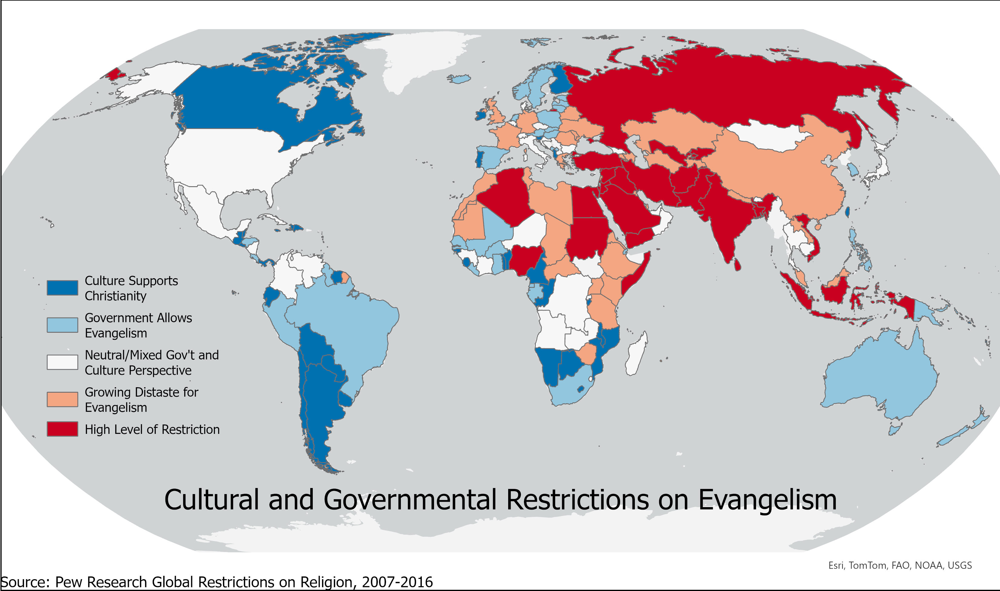
Fig. 7: [Restrictions on Evangelism PDF](./maps/pewResearch.pdf)

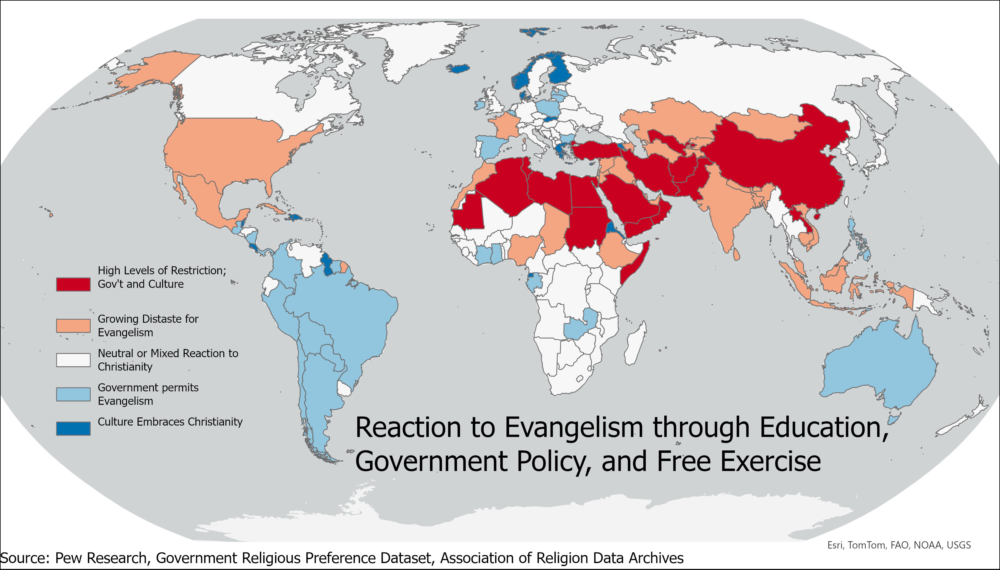
Fig. 8: [Reaction to Evangelism PDF](./maps/compositeScore.pdf)

### Data sources

### Findings

### Process

## 2010 Tuberculosis Maps - Fall 2023

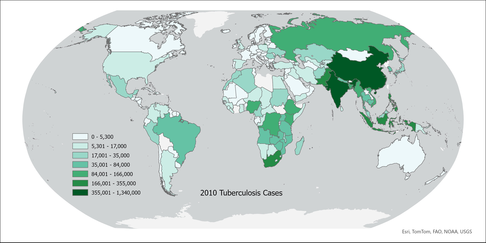
Fig. 9: [Tuberculosis Cases in 2010 PDF](./maps/tbCases.pdf)

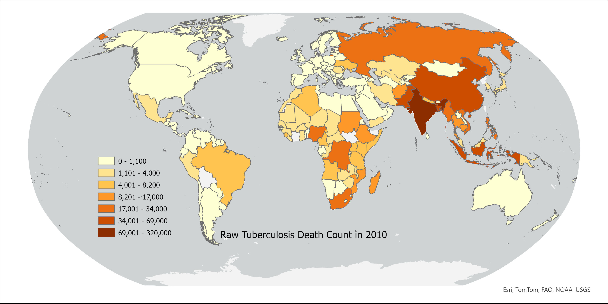
Fig. 10: [Tuberculosis Cases in 2010 PDF](./maps/tbDeaths.pdf)

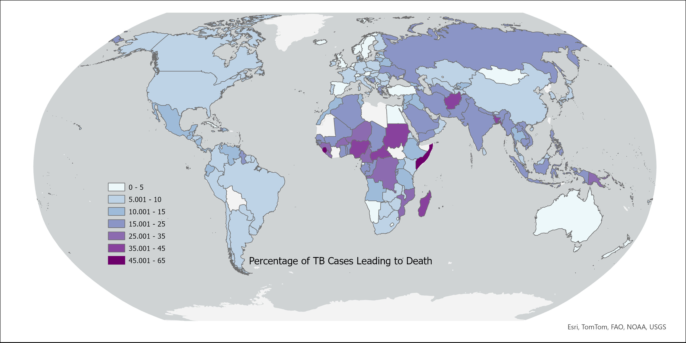
Fig. 11: [Tuberculosis Cases leading to Death 2010 PDF](./maps/tbCasesToDeaths.pdf)

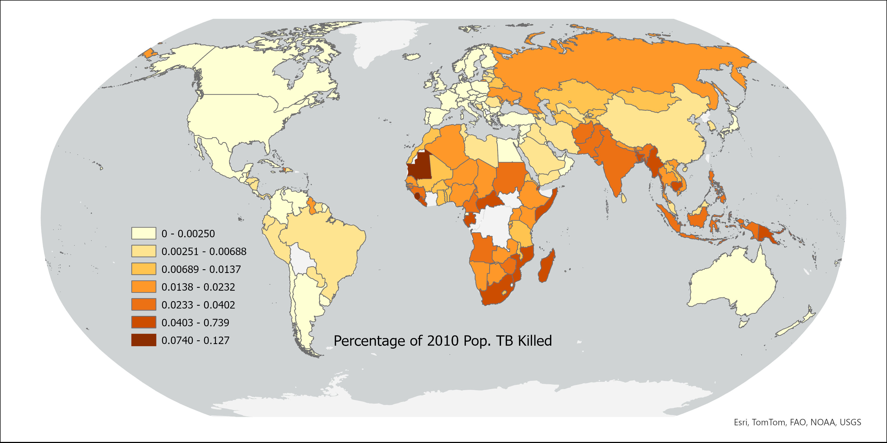
Fig. 12: [Percentage of Country Population that died to TB 2010](./maps/percentDeathPop.pdf)

### data sources

### findings and highlights

these are in the powerpoint

### methodology

## Lexington Land Use - Spring 2024

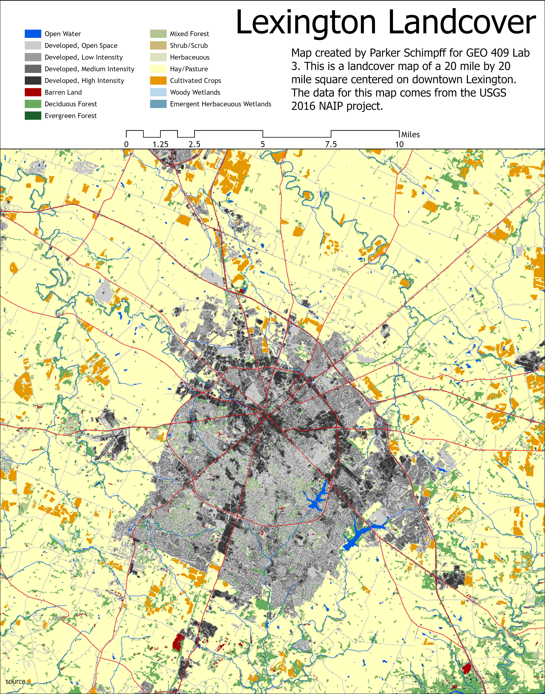
Fig. 13: [Lexington Landcover PDF](./maps/lexLandcover.pdf)

## Campus Picnic Locator - Spring 2024

Fig. 14: [Picnic Locator Map PDF](./maps/picnic.pdf)

### Reason for creating

### Data sources

### Python code 

1. Set workspace as geodatabase containing DEM, DSM, and NAIP rasters clipped for the UK Campus.
2. Create a NDVI (Normalized Difference Vegetation Index) of campus using the command *arcpy.ia.NDVI()* with the NAIP raster as the target variable. This creates a raster layer for NDVI of the campus
3. Create a height raster (DSM-DEM)
4. Using the *arcpy.sa.SurfaceParameters* tool, using parameters to find aspect out of the DEM raster, create an aspect raster. The aspect raster will allow us to specify to search for Southern facing areas of campus.
5. Specify a "picnic" variable to be (1) Southern Facing, (2) Green (vegetation), and (3) Less than 5 feet in height (as to not be in a tree/bush).

        picnic = (ndvi > 0.2) & (height < 5) & (south)

This is the [IPYNB Script used](./scripts/pdsc227-lab-03.ipynb).

## India Water Map - Spring 2024