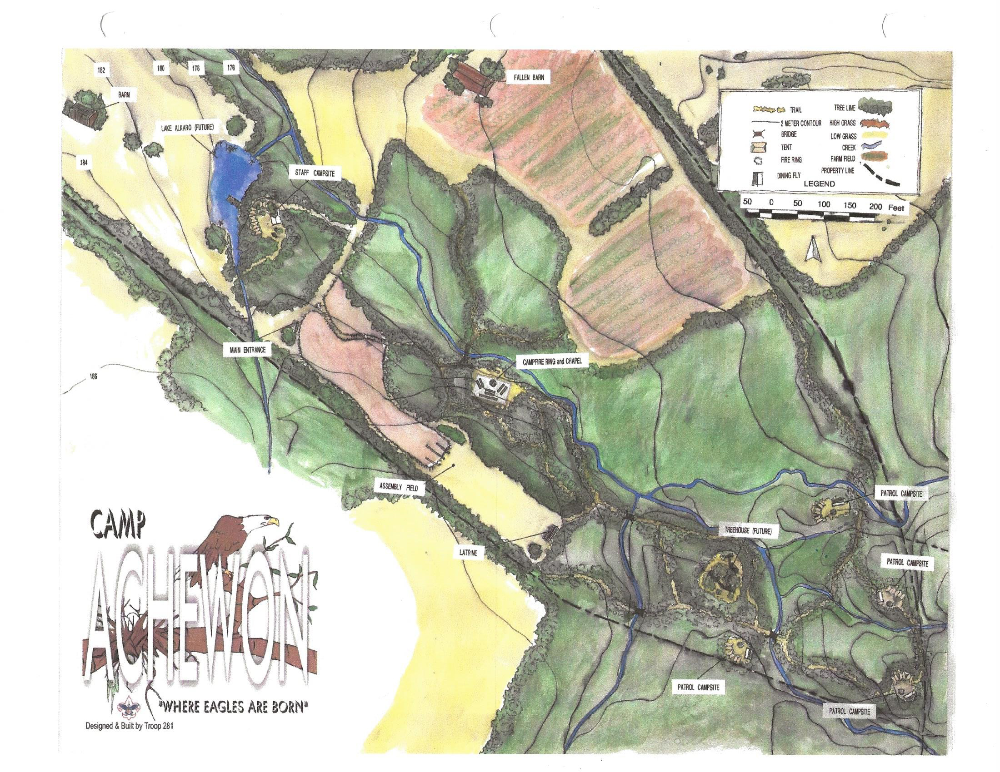

                    **Welcome to Parker Schimpff's Map portfolio!**

Fig. 1: Picture of me in front of Lake One in the Boundary Waters Wilderness Area

I am...

- A Sophomore at the University of Kentucky
- Majoring in Natural Resources and Environmental Science
- Minoring in GIS/Mapping and Jazz Piano Performance
- An intermediate Spanish speaker (may be an overestimation)
- A member of the Men's Acapella group on campus, acoUstiKats
- The pianist for Williamstown Christian Church
- An Eagle Scout
- A bookworm
- And, among many other things, an amatuer map maker

The goal of this webpage is simple: to present my work in ArcGIS Pro. From here down will be a display of many maps I have created for research, recreation, and coursework. There will be descriptions of why the map was created, what was found through the map, methodology of creating the map, data sources, and python code used (if any).

## Kentucky Landcover Map - February 2024

Fig. 2: [Kentucky Landcover PDF](./maps/kyLandcover2.pdf)

This map was created for my Advanced GIS class (GEO 409) in the Spring of 2024. It was created to be put in this [website](https://schimpffafa.github.io/geo409-field-trip/) which was my first assignment in website creation through Github and Visual Studio Code (the same program being used to create this portfolio!). This map was created completely through python code.

The 2016 National Landcover Dataset and the Shaded Relief dataset were acquired from MRLC and The National Map Download Service respectively.

### Python Code Flow

1. Set input database, output database, environment workspace (same as input), spatial reference 3089 (KY FIPS).
2. Set area of interest variable to be the Kentucky State Polygon
3. Inside a *for* loop, use the *arcpy.analysis.Clip* command to clip all feature classes in input database by the area of interest.  The same command is used for all the raster layers. The clipped layers were outputted into the output database.
4. Set the environment workspace to the output database.
5. Use the *arcpy.da.SearchCursor* command on the clipped land cover raster in order to determine counts of cells for different land cover uses. Using this, along with math in a for loop, do calculations and print percentage of sq. miles of land use for each type of land use.

  
Fig. 3: Results from the search cursor tool

This is the [IPYNB Script used](./scripts/landcoverClipping.ipynb).

## UK Campus Canopy Tree Height Map - Spring 2024

Fig. 4: [Campus Canopy PDF](./maps/CanopyHeightModel.pdf)

This map was created for my Advanced GIS class (GEO 409) in the Spring of 2024. It was created to be put in this [website](https://schimpffafa.github.io/geo409-field-trip/) which was my first assignment in website creation through Github and Visual Studio Code (the same program being used to create this portfolio!). This map was the second map included in that assignment, in conjunction with the Landcover map shown directly above this section. This map was created completely through python code.

The data for this map came from a variety of places. The DEM and DSM files are from the Kentucky from Above database. The NAIP is a national project from the US Geological Survey (USGS). The basemap is a standard basemap given by ESRI.

### Python Code Flow

1. Set workspace as geodatabase containing DEM, DSM, and NAIP rasters clipped for the UK Campus.
2. Create a height raster (DSM-DEM)
3. Create a NDVI (Normalized Difference Vegetation Index) of campus using the command *arcpy.ia.NDVI()* with the NAIP raster as the target variable. This creates a raster layer for NDVI of the campus
4. Using those two variables, height and NVDI, we can use variable geometry to create a new raster of trees on campus. This was the code used:

        trees = arcpy.sa.Con(((ndvi > 0.1) & (height > 5)), height)
        trees.save('campus_trees_ndvi_01')

5. Once the trees layer is completed, use the *arcpy.sa.RemapRange* tool to re-class the raster layer into height groups. For this map, I chose 6 height groups that are visible in the legend.

This is the [IPYNB Script used](./scripts/model-tree-height.ipynb).

## Schimpff Farm 5040 OH State Route 222 - Fall 2023

Fig. 5: [Schimpff Farm PDF](./maps/farmPrint.pdf)

### Motivation

This map was a pet project. Truly, it was inspired by this map:

Fig. 6: [Camp Achewon Drawn Map](./maps/achewon.pdf)

My grandfather, for more than 50 years, lived on a piece of property, nicknamed "The Farm" by the family. A few years back, they sold the property. For many years, the farm was used by a local Boy Scout Troop, Troop 281 out of Anderson, Ohio, who worked with my grandfather in order to make trails, bridges, fields, and campsites. In the late 90s/early 2000s, the scouts at the time drew this map, with proposed additions to the land and a proposition to appeal to the Dan Beard Council to make Camp Achewon a recognized scout camp, available to be used by the whole council, not just Troop 281. Although these aspirations (specifically the treehouse and the lake) never materialized, the map they created was quite realistic and spatially accurate, and provided a good baseline to create drawn layers showing trails and campsites on top of ariel photography.

### Methodology

The farm is in Clermont County, OH, which has a GIS department. Using ariel photography from the summer of 2017 from Clermont Co. GIS, as well as feature classes for 2ft/10ft contour lines, property lines, streams, lakes, etc. I was able anchor and geo-reference the Achewon map over the ariel photography using property line edges, stream forks, and 2ft contour lines. Once this was completed, I was able to draw the trails and campsites by hand using the Achewon map.

Once this was completed, all that was left to do was to add labels to the trails and put the map into a lay out and do post mapping cartography work. The finished product was printed on 11x17 tabloids, framed, and given to my grandfather and father for Christmas 2023.

## Lexington Land Use - Spring 2024

Fig. 7: [Lexington Landcover PDF](./maps/lexLandcover.pdf)

### Motivation and Data Sources

This was a proof of concept lab assignment for GEO 409. The main focus of this lab was to be able to create a square polygon centered around a point (in this case Downtown Lexington) and use that polygon to clip other layers.

This project used the MRLC 2016 National Landcover dataset. The stream and road vector data came from the Kentucky from Above dataset.

### Python Code Flow

The following is the general flow of the python code used to create the content of this map:

1. Set workspace as geodatabase containing KY Landcover, Streams, and Roads. 
2. Set Lat and Long of the intersection at Main and Limestone. Use arcpy commands to create a point in the center of the intersection. The following is the code in question.

        # set the location of the intersection at Main and Limestone
        lat = 38.046372
        lon = -84.497024
        # create point
        point = arcpy.Point(lon, lat)
        # create point geometry using wgs84
        ptGeometry = arcpy.PointGeometry(point, wgs84)
        # show that bad boy below
        ptGeometry

3. After this, create a 10 mile buffer around this point and convert from a circular polygon to a square polygon.
4. Use this polygon to clip necessary raster and vector datasets.

This is the [IPYNB Script used](./scripts/pdsc227-lab-02.ipynb).

## Campus Picnic Locator - Spring 2024

Fig. 8: [Picnic Locator Map PDF](./maps/picnic.pdf)

### Motivation and Data

This was a lab assignment for my GEO 409 course at UK. It was a Valentine's Day themed assignment and aimed to find areas on campus that would be well suited for a picnic. The criteria were that the location is Southward facing, on an elevation below 5 feet, and on green vegetation.

The data for this map was the NAIP dataset from the USGS, the DSM and DEM dataset from the Kentucky from Above. 

### Python Code Flow

1. Set workspace as geodatabase containing DEM, DSM, and NAIP rasters clipped for the UK Campus.
2. Create a NDVI (Normalized Difference Vegetation Index) of campus using the command *arcpy.ia.NDVI()* with the NAIP raster as the target variable. This creates a raster layer for NDVI of the campus
3. Create a height raster (DSM-DEM)
4. Using the *arcpy.sa.SurfaceParameters* tool, using parameters to find aspect out of the DEM raster, create an aspect raster. The aspect raster will allow us to specify to search for Southern facing areas of campus.
5. Specify a "picnic" variable to be (1) Southern Facing, (2) Green (vegetation), and (3) Less than 5 feet in height (as to not be in a tree/bush).

        picnic = (ndvi > 0.2) & (height < 5) & (south)

This is the [IPYNB Script used](./scripts/pdsc227-lab-03.ipynb).

## Resistance to Evangelism Worldwide - Fall 2023

Fig. 9: [Restrictions on Evangelism PDF](./maps/pewResearch.pdf)

Fig. 10: [Reaction to Evangelism PDF](./maps/compositeScore.pdf)

### Importance and Findings

There is a famous phenomenon known as the "10-40" window in Global Evangelist studies. It refers to an area of North Africa, the Middle East and Asia approximately between 10 degrees north and 40 degrees north latitude. Inside this window, there are remarkably low rates of Christianity, whether due to lack of knowledge, government control, or societal pressures. I decided to take this trend and rework it with data I found myself.

The idea of this project was to assess acceptance of Christianity/Evangelism in four areas: Culture, Offical Country Status on Religion, Governmental Bias, and Rights to Free Exercise of Religion of choice. 

### Methodology

For each raw score for each of the four areas, Cultural, Official Status, Gov’t Bias, and Free Exercise, a Z score was calculated with the following equation:

Z = Individual Country Score - Average of World Scores / Standard Deviation of World Scores

The Z score allowed two things: 1. To create a standard scale: more negative numbers being more docile towards Christianity and Evangelism, more positive being more hostile. 2. To allow for a composite score between the four to be possible, by adding the numbers up, it allowed us to see which countries got further against/for their beliefs and which countries had mixed reactions between cultural and governmental opinion. 

### Data Sources

The data for this project came from the Pew Research Center, the Government Religious preference Dataset, and the ASsociation fo Religion Data Archives.

## 2010 Tuberculosis Maps - Fall 2023

Fig. 11: [Tuberculosis Cases in 2010 PDF](./maps/tbCases.pdf)

Fig. 12: [Tuberculosis Cases in 2010 PDF](./maps/tbDeaths.pdf)

Fig. 13: [Tuberculosis Cases leading to Death 2010 PDF](./maps/tbCasesToDeaths.pdf)

Fig. 14: [Percentage of Country Population that died to TB 2010](./maps/percentDeathPop.pdf)

### Data Sources

The data used in these maps came from the Centers for Disease Control and Prevention and United Nations's UNdata databases. I personally scrubbed the data and compiled it into a useable state for this project.

### Importance and Findings

This project was a midterm assignment for GEO 309 (Intro to GIS) at the University of Kentucky. It was mostly used as a proof of concept in basic map making and showing trends with chloropleth maps. 

Tuberculosis is the world's deadliest disease, even though, Tuberculosis is treatable. However, in much of the world where this disease still ravages, it is due to lack of equitable assess to diagnostic capabilities as well as treatment measures. 

### Process

1. Downloading datasets, understanding what data is available, and compiling it into a useable file.
2. Importing this data into ArcGIS. Country polygons were used to join the data to a polygon. 
3. The next step was creating multiple (5) different maps, highlighting different parts of the data. 
4. The final step was creating layouts for every map, adding legends, as well as backend cartography to make the maps readable. 

## India Water Map - Spring 2024

Fig. 15: [Midna Water Map PDF](./maps/IndiaWater.pdf)

### Reasoning

A friend who attends Boyce College in Louisville, KY is in a class on for profit business planting in impoverished areas. As part of a final group project, she was tasked to find a business plan in the city of Midna, India. The groups idea was a water purification business that sells to the city of Midna. An integral part of this was determining (1) locations that a purification plant could be built and (2) areas of the city that would benefit the most from a plant being there. Naturally, a map of the area's water sources would be very useful in determining this location. 

### Importance and Findings

The map shows a few important things. 
1. Two unlabeled circles exist on the map. The inner one has a diameter of 2 mi, while the outer one has a diameter of 4 mi, and both are centered on the very center of Midna. 
2. This map marks locations of Reservoirs, Rivers, Open Water, Natural Wells, and Dug Wells.
3. This map shows a trend of water sources being on the Eastern side of Midna, showing depravity of water access to the Western and rural areas of Midna. 
4. The map also shows the pressing need of water access for locals. If you are a resident on the outskirts of town, it could be miles of walking in and out of the downtown area to access water.

### Data Sources

This data came from Esri India Content. 

### Methodology

In this map, I imported important datasets (the basemap and water source locations) and then ran a python buffer tool on the center of Midna. The first buffer ran at a 1 mi radius and the second ran at a 2 mi radius. 